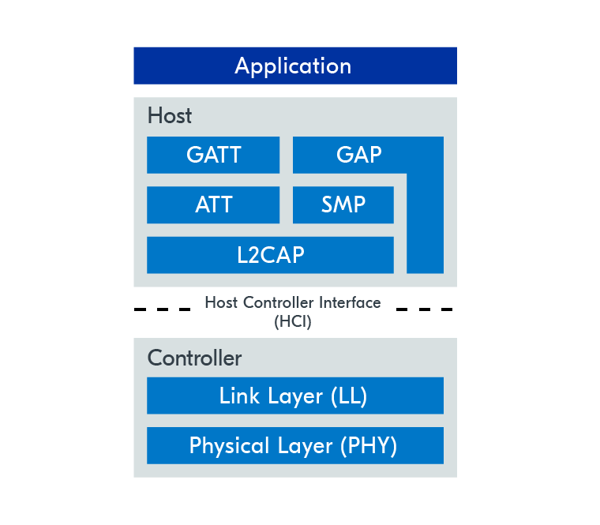
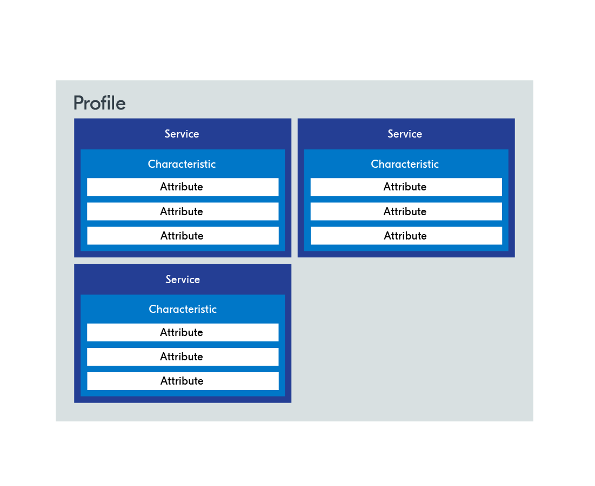
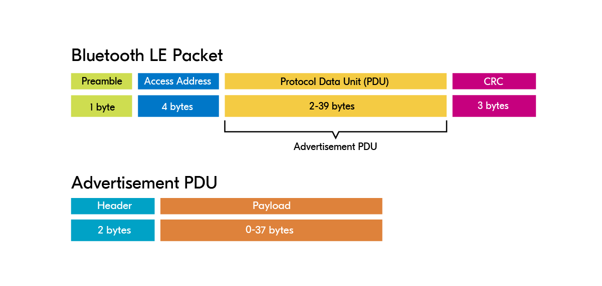

# Bluetooth Low Energy

[Zephyr Bluetooth Host](https://developer.nordicsemi.com/nRF_Connect_SDK/doc/latest/zephyr/connectivity/bluetooth/bluetooth-arch.html#host)

## Fundamentals

### Host

The Bluetooth LE host consists of the following layers:

- Logical Link Control & Adaptation Protocol (L2CAP): provides data encapsulation services to the upper layers.
- Security Manager Protocol (SMP): defines and provides methods for secure communication.
- Attribute Protocol (ATT): allows a device to expose certain pieces of data to another device.
- Generic Attribute Profile (GATT): defines the necessary sub-procedures for using the ATT layer.
- Generic Access Profile (GAP): interfaces directly with the application to handle device discovery and connection-related services.

The Zephyr Bluetooth Host implements all these layers and provides an API for applications.

### Controller

The Bluetooth LE controller is comprised of the following layers:

- Physical Layer (PHY): determines how the actual data is modulated onto the radio waves, and how it is transmitted and received.
- Link Layer (LL): manages the state of the radio, defined as one of the following – standby, advertising, scanning, initiating, connection.

### Definitions

- Advertising: The process of transmitting advertising packets, either just to broadcast data or to be discovered by another device.
- Scanning: The process of listening for advertising packets.
- Central: A device role that scans and initiates connections with peripherals.
- Peripheral: A device role that advertises and accepts connections from centrals.
- Broadcaster: A special kind of peripheral that broadcasts advertisement packets without accepting any connection requests.
- Observer: A special kind of central that listens to advertising packets without initiating a connection.

### Network topologies

- `Broadcast` data transfer happens without the devices ever establishing a connection. This is done by using the advertisement packets to broadcast
the data to any device that is in range to receive the packets.
- `Connected` network topology establishes a connection before data transfer occurs. Unlike the broadcast topology, the communication is now bidirectional.
- `Multi-role` A single device can also operate in multiple different roles simultaneously. For instance, the same device can act as a peripheral in
one setting, and a central in another.

### ATT & GATT

- Attribute Protocol - ATT layer is the basis on which data is transmitted, received, and handled in the connection phase of Bluetooth LE devices.
It is based on a client-server architecture.
  - GATT server: Device that stores data and provides methods for the GATT client to access the data.
  - GATT client: Device that accesses the data on the GATT server, through specific GATT operations which will be explained in Lesson 4.
  - Attribute: A standardized data representation format defined by the ATT protocol

- Generic Attribute Profile - GATT layer sits directly on top of the ATT layer, and builds on it by hierarchically classifying attributes into profiles,
services and characteristics. The GATT layer uses these concepts to govern the data transfer between Bluetooth LE devices.

### PHY - Physical Layer

- 1M PHY - classic 1 Megabit PHY supported by all Bluetooth
- 2M PHY - 2 Megabit PHY is supported Bluetooth v5.0, decreased battery usage with less communication range
- Coded PHY - longer communication range by sacrificing data rate

### Advertising types

- Connectable vs. non-connectable: Determines whether the central can connect to the peripheral or not.
- Scannable vs. non-scannable: Determines if the peripheral accepts scan requests from a scanner.
- Directed vs. undirected: Determines whether advertisement packets are targeted to a specific scanner or not.

`Scannable and connectable (ADV_IND)`
`Directed connectable (ADV_DIRECT_IND)`
`Non-connectable and scannable (ADV_SCAN_IND)`
`Non-connectable and non-scannable (ADV_NONCONN_IND)`

### Advertisement packet

Protocol Data Unit (PDU) consists of either an advertising PDU (advertising channel PDU) or a data PDU (channel PDU)

The advertisement payload structure depends on the kind of advertising being used. For example, when doing directed advertisement, some
space is needed to also specify the receiver’s address.

## Connection process

### Disconnected by supervision timeout

The other reason a device may disconnect is if it stops responding to packets. There can be several reasons for this. Either the application on the
connected device crashed and reset (which is not too uncommon, especially during the development phase), the connected device ran out of battery, or
the connected device was taken out of radio range. The amount of time it takes before the connection times out is set by the connection supervision
timeout parameter, which we will discuss in more detail in the next topic.

- The `MTU` is the number of bytes that can be sent in one GATT operation (for example, a send operation), while `data length` is the number of bytes
that can be sent in one Bluetooth LE packet.
`MTU` has a default value of `23 bytes`, and `data length` has a default value of `27 bytes`.
