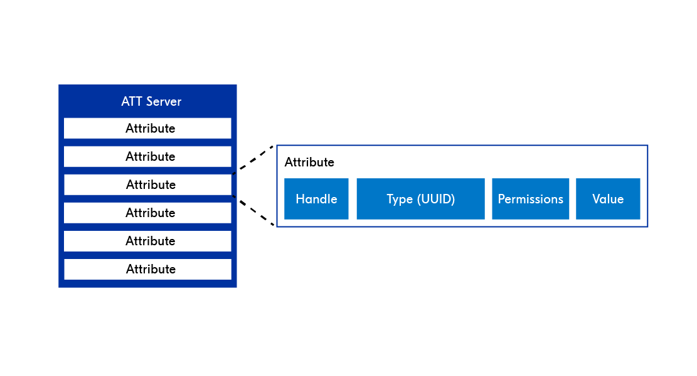
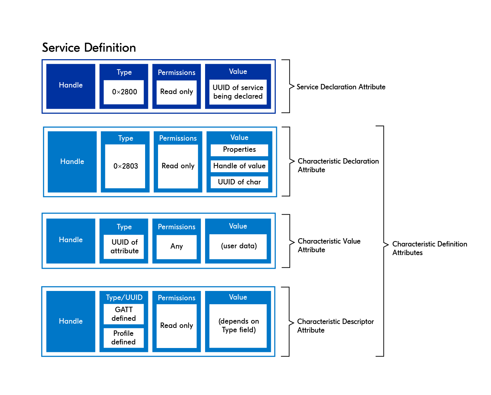

# Bluetooth Low Energy

[Zephyr Bluetooth Host](https://developer.nordicsemi.com/nRF_Connect_SDK/doc/latest/zephyr/connectivity/bluetooth/bluetooth-arch.html#host)

## Fundamentals

### Host

The Bluetooth LE host consists of the following layers:

- Logical Link Control & Adaptation Protocol (L2CAP): provides data encapsulation services to the upper layers.
- Security Manager Protocol (SMP): defines and provides methods for secure communication.
- Attribute Protocol (ATT): allows a device to expose certain pieces of data to another device.
- Generic Attribute Profile (GATT): defines the necessary sub-procedures for using the ATT layer.
- Generic Access Profile (GAP): interfaces directly with the application to handle device discovery and connection-related services.

The Zephyr Bluetooth Host implements all these layers and provides an API for applications.

### Controller

The Bluetooth LE controller is comprised of the following layers:

- Physical Layer (PHY): determines how the actual data is modulated onto the radio waves, and how it is transmitted and received.
- Link Layer (LL): manages the state of the radio, defined as one of the following – standby, advertising, scanning, initiating, connection.

### Definitions

- Advertising: The process of transmitting advertising packets, either just to broadcast data or to be discovered by another device.
- Scanning: The process of listening for advertising packets.
- Central: A device role that scans and initiates connections with peripherals.
- Peripheral: A device role that advertises and accepts connections from centrals.
- Broadcaster: A special kind of peripheral that broadcasts advertisement packets without accepting any connection requests.
- Observer: A special kind of central that listens to advertising packets without initiating a connection.

### Network topologies

- `Broadcast` data transfer happens without the devices ever establishing a connection. This is done by using the advertisement packets to broadcast
the data to any device that is in range to receive the packets.
- `Connected` network topology establishes a connection before data transfer occurs. Unlike the broadcast topology, the communication is now bidirectional.
- `Multi-role` A single device can also operate in multiple different roles simultaneously. For instance, the same device can act as a peripheral in
one setting, and a central in another.

### ATT & GATT

- Attribute Protocol - ATT layer is the basis on which data is transmitted, received, and handled in the connection phase of Bluetooth LE devices.
It is based on a client-server architecture.
  - GATT server: Device that stores data and provides methods for the GATT client to access the data.
  - GATT client: Device that accesses the data on the GATT server, through specific GATT operations which will be explained in Lesson 4.
  - Attribute: A standardized data representation format defined by the ATT protocol

- Generic Attribute Profile - GATT layer sits directly on top of the ATT layer, and builds on it by hierarchically classifying attributes into profiles,
services and characteristics. The GATT layer uses these concepts to govern the data transfer between Bluetooth LE devices.

### PHY - Physical Layer

- 1M PHY - classic 1 Megabit PHY supported by all Bluetooth
- 2M PHY - 2 Megabit PHY is supported Bluetooth v5.0, decreased battery usage with less communication range
- Coded PHY - longer communication range by sacrificing data rate

### Advertising types

- Connectable vs. non-connectable: Determines whether the central can connect to the peripheral or not.
- Scannable vs. non-scannable: Determines if the peripheral accepts scan requests from a scanner.
- Directed vs. undirected: Determines whether advertisement packets are targeted to a specific scanner or not.

`Scannable and connectable (ADV_IND)`
`Directed connectable (ADV_DIRECT_IND)`
`Non-connectable and scannable (ADV_SCAN_IND)`
`Non-connectable and non-scannable (ADV_NONCONN_IND)`

### Advertisement packet

Protocol Data Unit (PDU) consists of either an advertising PDU (advertising channel PDU) or a data PDU (channel PDU)

The advertisement payload structure depends on the kind of advertising being used. For example, when doing directed advertisement, some
space is needed to also specify the receiver’s address.

## Connection process

When the central sends a connection request, the peripheral and central have established a bi-directional connection (connection-oriented) channel.

connection interval in Bluetooth LE - The interval at which the devices wake up to exchange data

### Disconnected by supervision timeout

The other reason a device may disconnect is if it stops responding to packets. There can be several reasons for this. Either the application on the
connected device crashed and reset (which is not too uncommon, especially during the development phase), the connected device ran out of battery, or
the connected device was taken out of radio range. The amount of time it takes before the connection times out is set by the connection supervision
timeout parameter, which we will discuss in more detail in the next topic.

- The `MTU` is the number of bytes that can be sent in one GATT operation (for example, a send operation), while `data length` is the number of bytes
that can be sent in one Bluetooth LE packet.
`MTU` has a default value of `23 bytes`, and `data length` has a default value of `27 bytes`.

## Data exchange in Bluetooth LE

Closer look at the Generic Attribute Protocol (GATT), its underlayer Attribute Protocol (ATT).
Learn how to represent and exchange data between two connected Bluetooth LE devices using different GATT operations.

### Client-initiated operations

GATT operations where the client requests data from the GATT server.

Operation used byclient to retrieve services: service discovery,service discovery operation,discovery

- Read - read request to the server. To which the server responds by returning the attribute value.
- Write - sends a write request and provides data that matches the same format of the target attribute. If the server accepts the write operation,
it responds with an acknowledgement.
- Write without response - client can write data to an attribute without waiting for an acknowledgment from the server.

### Server-initiated operations

These operations are initiated by the server, but the client is required to enable them first by subscribing to the characteristic and enabling either
notifications or indications.

- Notify - server automatically push the value of a certain attribute to the client, without the client asking for it.
- Indicate - Indicate will also push the attribute value directly to the client. However, in this case, an acknowledgment from the client is required
(for this you can only send one Indication per connection interval)

## Services and characteristics

ATT layer defines attributes and how data is exposed between a client and a server.

### Attributes

ATT layer defines how data is stored and accessed in a server’s database.
Data is stored in the form of data structures called Attributes.

- Handle: A 16-bit unique index to a specific attribute in the attribute table, assigned by the stack.
- Type (UUID): Universally unique ID (UUID), which tells us the attribute type.
- Permissions: The security level required (encryption and/or authorization) to handle that attribute, in addition to indicating whether it’s a
readable and/or writeable attribute.
- Value:
  - User data (ex: sensor reading) that is stored in the attribute. This field accepts any data type.
  - It can also hold information (metadata) about another attribute.

### Universally unique ID (UUID)

It is a unique number used to identify attributes and tells us about their significance. UUIDs have two types.

- SIG-defined 16-bit UUID.
- 128-bit UUID, sometimes referred to as a vendor-specific UUID. This is the type of UUID you need to use when you are making your own custom
services and characteristics.

### Services

Attributes are the main building blocks for services.

- service definition - is comprised of multiple attributes arranged in a GATT-specified format which facilitates standardized data exchange between
Bluetooth LE devices. Service definitions always start with a **service declaration attribute**.
- service declaration attribute - holds metadata about the service, it also indicates the beginning of a service in the sequence of services stored
on a GATT server.
- characteristic declaration attribute - characteristic is comprised of at least two attributes and optionally more.
Characteristic definition starts with a declaration attribute, to indicate the beginning of a characteristic in the sequence of characteristics in a
service definition attributes:

  

  - Characteristic declaration attribute: Holds metadata about the Characteristic Value Attribute.
    - Characteristic properties: What kind of GATT operations are permitted on this characteristic.
    - Characteristic value handle: The handle (address) of the attribute that contains the user data (value), i.e the characteristic value attribute.
    - Characteristic UUID: The UUID of the characteristic being declared.
  - Characteristic value attribute: Holds the actual user data.
  - Characteristic descriptor attribute (optional): Holds more metadata about the characteristic (GATT-defined Client Characteristic
  Configuration Descriptor (CCCD) is the most commonly used)
    - CCCD is a specific type of characteristic descriptor that is necessary when the characteristic supports server-initiated
    operations (i.e Notify and Indicate). This is a writable descriptor that allows the GATT client to enable and
    disable notifications or indications for that characteristic.

A service can have zero or more characteristic definitions (commonly referred to as characteristics).
A characteristic is comprised of at least two attributes and optionally more.

## Security in BLE

- Pairing: The process of generating, distributing, and authenticating keys for encryption purposes.
- Bonding: The process of pairing followed by distribution of keys used to encrypt the link in future reconnections.

### Pairing

- Initiation: send pairing request (only contral), peripheral sends pairing response (`Security Request` or `I/O capabilities`: DisplayOnly/DisplayTesNo/KeyboardOnly/NoInputNoOutput/KeyboardDispay)
- Perform pairing: Just Works (plain text, unauthenticated), Passkey Entry (6-digit), Out of Band, Numeric Comparison)
- Key distribution: LTK (Long Term Key) is used to distribute the rest of the keys

### Legacy Pairing

Prior to Bluetooth v4.2.
STK (Short Term Key) encrypting link can be easly cracked (999999 combinations) and have no MITM protection.

### LE Secure Connections

Use Elliptic-Curve Diffie-Hellman (ECDH) cryptography to generate a public-private key pair.
They will use one of the four pairing methods (Just Works, Passkey entry, OOB or Numeric Comparison)
The only data exchanged between the peers is the public keys. The use of the ECDH public key cryptography makes it extremely difficult to crack the LTK

### Security concerns

- Identity tracking
- Sniffing (Passive eavesdropping)
- MITM (Active eavesdropping - Man-In-The-Middle attack)

### Security Levels

1. No security (open text, meaning no authentication and no encryption)
2. Encryption with unauthenticated pairing (Just Works)
3. Authenticated pairing with encryption (Passkey entry or OOB)
4. Authenticated LE Secure Connections pairing with encryption

`Permissions` field  of `attribute` - determines security level of connection if accesible

### Filter Accept List

Accepting only connection from whitelist

