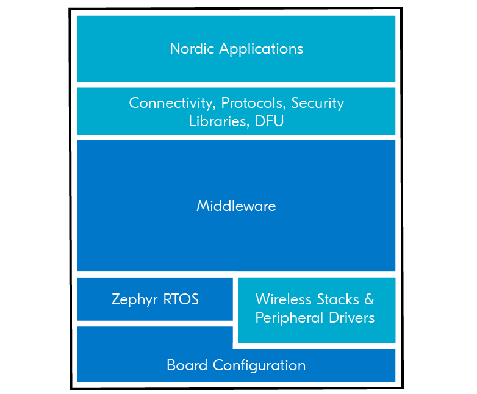
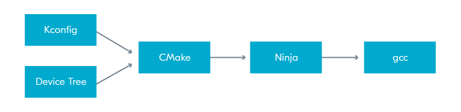
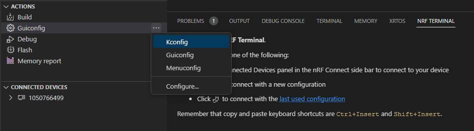
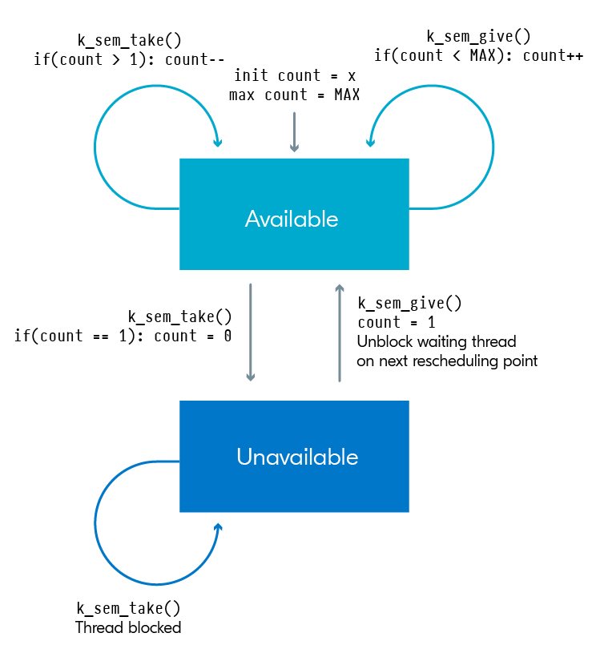
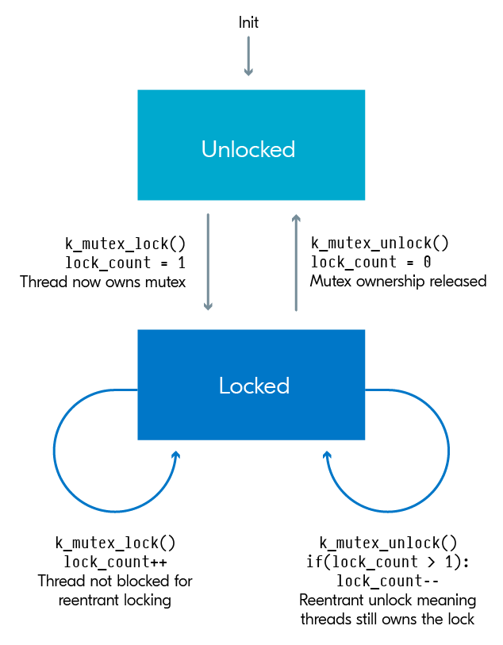

# nRF Connect SDK Fundamentals

[Documentation](https://developer.nordicsemi.com/nRF_Connect_SDK/doc/latest/nrf/index.html)</br>
[API GPIO documentation](https://developer.nordicsemi.com/nRF_Connect_SDK/doc/latest/zephyr/hardware/peripherals/gpio.html)</br>
[Logging documentation](https://developer.nordicsemi.com/nRF_Connect_SDK/doc/latest/zephyr/services/logging/index.html#logging-api)</br>

`RTOS` - serve real-time applications that process data as it comes in, typically without buffer delays. These applications include embedded systems,
telecommunications, and industrial automation systems.

The key features of an RTOS include:

- Deterministic Scheduling: RTOSs provide deterministic scheduling, meaning that the system can predict the exact time at which a task will be executed.
This is crucial for systems where timing is critical.

- Preemptive Scheduling: RTOSs use preemptive scheduling, which means that a high-priority task can interrupt a lower-priority task. This is important
for systems where certain tasks must be completed before others.

- Interrupt Handling: RTOSs provide efficient interrupt handling, which is crucial for systems that need to respond quickly to external events.

- Task Prioritization: RTOSs allow tasks to be prioritized, which means that tasks can be assigned different levels of importance. This is important
for systems where some tasks are more important than others.

- Real-Time Performance: RTOSs are designed to provide real-time performance, which means that they can process data as it comes in, typically without
buffer delays. This is important for systems where timing is critical.

In conclusion, RTOSs are designed for systems where timing is critical and where tasks must be executed in a specific order. They provide features such
as deterministic scheduling, preemptive scheduling, efficient interrupt handling, task prioritization, and real-time performance, which are crucial
for these types of systems.

`Zephyr OS` is a real-time operating system (RTOS) designed for resource-constrained systems, particularly in the Internet of Things (IoT) domain.
It is designed to be lightweight, efficient, and secure, with a focus on energy efficiency

Here are some key differences between Zephyr OS and consumer-based operating systems:

- Design and Purpose: Zephyr OS is designed for resource-constrained systems, particularly in the IoT domain, where energy efficiency is crucial.
It is designed to be lightweight and efficient, focusing on energy efficiency. Consumer-based operating systems like Windows or Ubuntu are designed
for a wide range of applications, from personal computing to server environments, and are not designed to be lightweight or energy-efficient.

- Security: Zephyr OS is designed with a focus on security. It provides long-term support, regular security updates, and a rigorously tested and
auditable code base. Consumer-based operating systems like Windows or Ubuntu also prioritize security, but they are not designed with the same level of
focus as Zephyr OS.

- Interoperability: Zephyr OS is designed to be interoperable across a wide range of hardware, software, and communication protocol options.
Consumer-based operating systems like Windows or Ubuntu are designed to be compatible with a wide range of hardware and software, but they are not
designed with the same level of interoperability as Zephyr OS.

- Ecosystem: Zephyr OS has a strong ecosystem, including a community that provides training and consulting, development tools, code libraries, and more.
Consumer-based operating systems like Windows or Ubuntu also have strong ecosystems, but they are not designed with the same level of community support
and development tools as Zephyr OS.

In conclusion, while Zephyr OS and consumer-based operating systems like Windows or Ubuntu serve different purposes and have different characteristics,
they both play crucial roles in the world of computing. The choice between them depends on the specific requirements of the application or system
being developed.

## Lesson 1



`Zephyr RTOS` is an open-source real-time operating system for connected and resource-constrained embedded devices. It includes a scheduler that ensures
predictable/deterministic execution patterns and abstracts out the timing requirements. It also comes with a rich set of fundamental libraries and middleware
that simplifies development and helps reduce a product’s time to market. Zephyr RTOS is highly configurable and enables scalable configurations from
very small configurations for memory-constrained devices (minimum 8 kilobytes, for example, simple LED blinking application) to powerful, feature-rich,
high-processing power devices (multiple MBs of memory) with large memory configurations.

Internally, the nRF Connect SDK code is organized into four main repositories:

- nrf – Applications, samples, connectivity protocols (Nordic)
- nrfxlib – Common libraries and stacks (Nordic)
- Zephyr – RTOS & Board configurations (open source)
- MCUBoot – Secure Bootloader (open source)



`west` is a core command-line utility that is internally invoked by the nRF Connect for VS Code to do many tasks including building, and flashing
applications to your board.

The `devicetree` describes the hardware and `Kconfig` generates definitions that configure the whole system.

## Lesson 2

examine how hardware is described in nRF Connect SDK, whether it is a development kit (DK), a System on Chip (SoC), a System in a Package (SiP).

Objectives

- Examine the devicetree API <zephyr/devicetree.h>
- Examine board-level devicetree .dts
- Examine SoC-level devicetree .dtsi
- Understand the purpose of devicetree binding files (.yaml) and the compatible property
- Understand the device driver model <zephyr/device.h>
- Analyze the decoupling between a device driver API and a device driver implementation and the need to have a device pointer
- Examine the generic GPIO interface APIs <zephyr/drivers/gpio.h>
- Practice through hands-on exercises configuring GPIO pins and learn how to read/write to/from GPIO pins and how to set up interrupts for input GPIO pins

### Devicetree

```sh
/dts-v1/;
/ {
        a-node {
                subnode_label: a-sub-node {
                        foo = <3>;
                };
        };
};
```

#### Devicetree bindings (YAML files)

It declares requirements on the contents of devicetree nodes, and provides semantic information about the contents of valid nodes.

```yaml
compatible: "nordic,nrf-sample"
properties:
  num-sample:
    type: int
    required: true
```

Sample DTS file (.dts) with the node `node0` that is set to the compatible `nordic,nrf-sample`. This means the `node0` node must have the required property
`num-sample` and that property must be assigned an integer value. Otherwise, the build will fail.

```sh
node0 {
     compatible = "nordic,nrf-sample";
     num-sample = <3>;
};
```

#### Aliases

name of the property is the name of that alias and the value of the property is a reference to a node in the device tree.

```sh
/ {
        aliases {
                subnode_alias = &subnode_label;
        };
};
```

The purpose here is that your C/C++ application code (Ex: main.c) will use the alias. The definition of fixed aliases (Ex: led0 for the first LED on a
board ) in boards’ dts files can make the application code more portable, as it can avoid hard-coding varying device node names and make the application
code more flexible to changes in the board used.

#### Accessing the devicetree

[Ways to get node-identifier](https://developer.nordicsemi.com/nRF_Connect_SDK/doc/latest/zephyr/build/dts/api-usage.html#node-identifiers)

To get information about a particular devicetree node in your source code, you need a node identifier for it. This is just a C macro that refers to
the node.

node identifier of a-sub-node:

```sh
DT_NODELABEL(subnode-label)
```

To get the value assigned to a certain devicetree property, we can use the macro DT_PROP().

```sh
DT_PROP(DT_NODELABEL(subnode-label), foo)
```

Device tree file is available in path: `<install_path>\zephyr\boards\arm\nrf52833dk_nrf52833\nrf52833dk_nrf52833.dts.`

```sh
cd /home/deimos/ncs/v2.5.0-rc2/zephyr/boards/arm/nrf52dk_nrf52832
code ./nrf52dk_nrf52832.dts
```

### Device driver model

In order to interact with a hardware peripheral or a system block, we need to use a device driver (or driver for short), which is software that deals
with the low-level details of configuring the hardware the way we want.

The following code snippet will take the devicetree node identifier returned by DT_NODELABEL() and return a pointer to the device object.
Then `device_is_ready()` verifies that the device is ready for use, i.e. in a state so that it can be used with its standard API.

```cpp
const struct device *dev;
dev = DEVICE_DT_GET(DT_NODELABEL(uart0));
if (!device_is_ready(dev)) {
    return;
}
```

### GPIO Generic API

To interact with the General-Purpose Input/Output (GPIO) peripheral, we can use the generic API <zephyr/drivers/gpio.h>, which provides user-friendly
functions to interact with GPIO peripherals.

When using any driver in Zephyr, the first step is to initialize it by retrieving the device pointer.

#### Initializing the API

Before using the device pointer contained in gpio_dt_spec led, we need to check if it’s ready using `device_is_ready()`.

```cpp
if (!device_is_ready(led.port)) {
    return;
}
```

#### Configure a single pin

This is done by calling the function `gpio_pin_configure_dt()`, which has the following signature:

```cpp
gpio_pin_configure_dt(&led, GPIO_OUTPUT);
```

The following line configures the pin led.pin as an output that is active low.

```cpp
gpio_pin_configure_dt(&led, GPIO_OUTPUT | GPIO_ACTIVE_LOW);
```

#### Write to an output pin

Writing to an output pin is straightforward by using the function `gpio_pin_set_dt()`, which has the following signature

For example, the following line sets the pin associated with gpio_dt_spec led, which can be denoted as led.pin, to logic 1 “active state”:

```cpp
gpio_pin_set_dt(&led, 1);
```

For example, the following line will toggle the pin led.pin, whenever this API is called.

```cpp
gpio_pin_toggle_dt(&led);
```

#### Read from an input pin

Reading a pin configured as an input is not as straightforward as writing to a pin configured as an output.
There are two possible methods to read the status of an input pin:

##### Polling

Polling means continuously reading the status of the pin to check if it has changed. To read the current status of a pin, all you need to do is to
call the function `gpio_pin_get_dt()`

For example, the following line reads the current status of led.pin saves it in a variable called val.

```cpp
val = gpio_pin_get_dt(&led);
```

##### Interrupt method

(Interrupt handler is also known as an interrupt service routine)

You can only configure an interrupt on a GPIO pin configured as an input.

1. Configure the interrupt on a pin.

   The following line will configure an interrupt on dev.pin on the change to logical level 1.

   ```cpp
   gpio_pin_interrupt_configure_dt(&button,GPIO_INT_EDGE_TO_ACTIVE);
   ```

2. Define the callback function `pin_isr()`.

   The signature (prototype) of the callback function is shown below

   ```cpp
   void pin_isr(const struct device *dev, struct gpio_callback *cb, gpio_port_pins_t pins);
   ```

3. Define a variable of type static struct `gpio_callback` as shown in the code line below.

   ```cpp
   static struct gpio_callback pin_cb_data;
   ```

4. Initialize the gpio callback variable `pin_cb_data` using `gpio_init_callback()`.

   For example, the following line will initialize the `pin_cb_data` variable with the callback function `pin_isr` and the bit mask of pin `dev.pin`.
   Note the use of the macro `BIT(n)`, which simply gets an unsigned integer with bit position `n` set.

   ```cpp
   gpio_init_callback(&pin_cb_data, pin_isr, BIT(dev.pin));
   ```

5. The final step is to add the callback function through the function `gpio_add_callback()`.

   For example, the following line adds the callback function that we set up in the previous steps.

   ```cpp
   gpio_add_callback(button.port, &pin_cb_data);
   ```

### Program example - blinky

1. Include modules

   ```cpp
   #include <zephyr/kernel.h>
   #include <zephyr/drivers/gpio.h>
   ```

2. Define the node identifier

   ```cpp
   #define LED0_NODE DT_ALIAS(led0)
   ```

3. Retrieve the device pointer, pin number, and configuration flags.

   ```cpp
   static const struct gpio_dt_spec led = GPIO_DT_SPEC_GET(LED0_NODE,  gpios);
   ```

4. Verify that the device is ready for use

   ```cpp
   if (!device_is_ready(led.port)) {
       return;
   }
   ```

5. Configure the GPIO pin

   ```cpp
   int ret;
   ret = gpio_pin_configure_dt(&led, GPIO_OUTPUT_ACTIVE);
   if (ret < 0) {
       return;
   }
   ```

6. Continuously toggle the GPIO pin

   ```cpp
   while (1) {
       ret = gpio_pin_toggle_dt(&led);
       if (ret < 0) {
           return;
       }
       k_msleep(SLEEP_TIME_MS);
   }
   ```

## Lesson 3

Create a minimal working application from scratch and add our own custom files and configurations to customize the application.

```sh
app/
|-- CMakeLists.txt
|-- Kconfig
|-- prj.conf
|-- <board_name>.overlay
|-- src/
    |-- main.c
```

Objectives

- Understand the use of Kconfig configuration files to enable and configure the different software modules available in the nRF Connect SDK
- Examine an application configuration file and a board configuration file and understand the relation between them
- Learn how to explore the available configuration options of a certain software module using guiconfig
- Understand multi-image builds, and how a child-image is added to your application
- Practice through hands-on exercises how to create an application from scratch, and how to add modules using Kconfig and modify the devicetree

### Configuration files

#### Application & board

Each configuration option must start with the prefix CONFIG_ followed by the name of the software module to configure, then the value to be set, with
no spaces around the equals sign.

```sh
CONFIG_<symbol_name>=<value>
```

- App cfg: prj.conf
- Brd cfg: <board_name>_defconfig in <nRF Connect SDK Installation Path>\zephyr\boards\arm\nrf52833dk_nrf52833.

You should never modify any board configuration files. Instead, rely on the application configuration file to set newconfigurations
and subsequently overwrite any default board configurations if needed.  If you change the board configuration file directly, then these changes will
apply for all projects using that board.

#### Kernel Configuration (Kconfig)

An alternative way to modify the contents of the prj.conf (application configuration file) is by using the Kconfig view.
It groups all functionalities provided by the Zephyr kernel into menus and submenus which can be viewed in a graphical tree format.

If instead of Kconfig, you find GUIconfig, you can still view Kconfig by viewing the submenu under Guiconfig.



### Devicetree overlays, CMake, and multi-image builds

(PATH to fully compiled devicetree of a build: application_path/build/zephyr/zephyr.dts)

It is not recommended to modify the devicetree directly, so instead we use devicetree overlays to do this.
The overlay only needs to include the node and property it wants to modify.

```sh
&spi1{
 status = "okay";
};
&pinctrl {
 spi1_default: spi1_default {
  group1 {
   psels = <NRF_PSEL(SPIM_MOSI, 0, 25)>;
  };
 };
 spi1_sleep: spi1_sleep {
  group1 {
   psels = <NRF_PSEL(SPIM_MOSI, 0, 25)>;
  };
 };
};
```

The overlay file shown above will set node spi1 to have the status okay, essentially enabling this node. Then it is changing the pin configuration for
the SPIM_MOSI line to pin 25 by changing the appropriate sub-nodes and properties in the &pinctrl node. Note that you must change the pin configuration
for both the default and sleep states.

### CMake

The file `CMakeLists.txt` is the main CMake project file and the source of this build process configuration.

### Multi-Image Builds

he firmware running on a device can consist of one application or image, or it can consist of multiple images, making it a multi-image build.

Multi-image builds are used in the following cases:

- Applications that have DFU enabled (serial, USB-CDC, BLE, etc.)
- Multi-core or multi-partition targets (nRF53 and nRF9160)

### App from scratch

Necessary 3 files:

- `/src/main.c`
- `prj.conf`
- `CMakeLists.txt`

CMakeLists

```sh
cmake_minimum_required(VERSION 3.20.0)
find_package(Zephyr REQUIRED HINTS $ENV{ZEPHYR_BASE})
project(hello_world)
target_sources(app PRIVATE src/main.c)
```

main.c

```cpp
#include <zephyr/kernel.h>
#include <zephyr/sys/printk.h>

void main(void)
{
 while(1) {
  printk("Hello World!\n\r");
  k_msleep(1000);
 }
}
```

### Adding custom configurations

create a file called Kconfig in the application directory (the same location as CMakeLists.txt and prj.conf). Make sure the file does not have a file extension.

```sh
source "Kconfig.zephyr"
config MYFUNCTION
  bool "Enable my function"
  default n
```

In CMakeLists.txt, we want the addition of the custom files to be conditional. Change the last line to use the function target_sources_ifdef(), like this:

```sh
target_sources_ifdef(CONFIG_MYFUNCTION app PRIVATE src/myfunction.c)
```

Enable the config by adding the following line to prj.conf

```sh
CONFIG_MYFUNCTION=y
```

Update main.c

```cpp
#include <zephyr/kernel.h>
#include <zephyr/sys/printk.h>
#ifdef CONFIG_MYFUNCTION
#include "myfunction.h"
#endif
void main(void)
{
 while(1){
  #ifdef CONFIG_MYFUNCTION
  int a = 3, b = 4;
   printk("The sum of %d and %d is %d\n\r", a, b, sum(a,b));
  #else
   printk("MYFUNCTION not enabled\r\n");
   return;
  #endif
  k_msleep(1000);
 }
}
```

Build and flash the application

If you will change in prj.conf to

```sh
CONFIG_MYFUNCTION=n
```

you will get the output: `MYFUNCTION not enabled`

### Modifying the devicetree - changing the baud rate at which information is sent to the console

Create an overlay file in the application directory (the same location as CMakeLists.txt and prj.conf) with the name of the board you’re using,
in our case nrf52833dk_nrf52833.overlay

In nRF Connect for VS Code, in the Details View, there is an option to create an overlay file with the same board name used for the build.

Add the following to the overlay file, which can be found in the root directory of the application, to change this property:

```sh
&uart0 {
 current-speed = <9600>;
};
```

Do a `pristine build` and flash the sample to the board.

Observe that the serial terminal doesn’t show any output. This is because we changed the baud rate in the application to 9600 baud/sec while the
serial terminal is launched with the default baud rate of 115200 baud/sec

## Lesson 4

We will learn more about logging using both the simple method of `printk()` and a sophisticated method using the advanced logging module.

- Learn how to print strings and formatted strings to a console using `printk()`
- Recognize the limitations of `printk()`
- Learn how to print strings and formatted strings to a console using the logger module
- Learn how to hex dump variables using the logger module
- Explore the logger module features
- Practice through hands-on exercises enabling/configuring software modules

### `printk()`

```cpp
#include <zephyr/sys/printk.h>
```

The syntax `printk()` is similar to the standard printf() in C.
However, `printk()` is a less advanced function that only supports a subset of the features that printf() does, making it optimized for embedded development.

A basic set of specifiers are supported:

- Signed decimal: %d, %i and its subcategories
- Unsigned decimal: %u and its subcategories
- Unsigned hexadecimal: %x (%X is treated as %x)
- Pointer: %p
- String: %s
- Character: %c
- Percent: %%
- New line: \n
- Carriage return: \r

Field width (with or without leading zeroes) is supported. Length attributes h, hh, l, ll and z are supported.
However, integral values with lld and lli are only printed if they fit in a long, otherwise ERR is printed.
Full 64-bit values may be printed with llx. Flags and precision attributes (float and double) are not supported by default,
but can be enabled manually (lesson 6).

Examples of use:

```cpp
printk("Button 1 was pressed!\n\r");

int x = 44;
printk("The value of x is %d\n\r",x);
```

To use `printk()` you need to:

1. Include the console drivers (enabling the configuration option CONFIG_CONSOLE in the application configuration file).
2. Select the console (UART console (CONFIG_UART_CONSOLE) and RTT console (CONFIG_RTT_CONSOLE)).
3. Include the header file `<zephyr/sys/printk.h>` in your application source code.

### Logger module

prj.conf

```sh
CONFIG_LOG=y
```

```cpp
#include <zephyr/logging/log.h>

LOG_MODULE_REGISTER(Less4_Exer2,LOG_LEVEL_DBG);
```

Recommended method for sending messages to a console, unlike the `printk()` function, which will not return until all bytes of the message are sent.

- Multiple backends
- Compile time filtering on module level
- Run time filtering independent for each backend
- Timestamping with user-provided function
- Dedicated API for dumping data
- Coloring of logs
- `printk()` support – printk message can be redirected to the logger

By using proper configuration options, logs can be gradually removed from compilation to reduce image size and execution time when logs are not needed.
During compilation, logs can be filtered out based on module and severity level.

When logging is enabled globally, it works for all modules. However, modules can disable logging locally.
Every module can specify its own logging level (`LOG_LEVEL_[level]`) or use `LOG_LEVEL_NONE`, which will disable the logging for that module.

The logger module is designed to be thread-safe and minimizes the time needed to log the message.

#### Severity levels

|||||
|---|---|---|---|
|1 (most severe) | Error | Severe error conditions | LOG_LEVEL_ERR |
|2 | Warning | Conditions that should be taken care of | LOG_LEVEL_WRN |
| 3 | Info | Informational messages that require no action | LOG_LEVEL_INF |
| 4 (least severe) | Debug Debugging messages | LOG_LEVEL_DBG|

`LOG_X` for standard printf-like messages, where `X` can be `DBG`, `INF`, `WRN`, or `ERR`.

```cpp
LOG_INF("Exercise %d",2);
LOG_DBG("A log message in debug level");
LOG_WRN("A log message in warning level!");
LOG_ERR("A log message in Error level!");
```

#### Dumping data

`LOG_HEXDUMP_X`  macros for dumping data where `X` can be `DBG`, `INF`, `WRN`, or `ERR`.

```cpp
uint8_t data[] = {0x00, 0x01, 0x02, 0x03,
                  0x04, 0x05, 0x06, 0x07,
                  'H', 'e', 'l', 'l','o'};
LOG_HEXDUMP_INF(data, sizeof(data),"Sample Data!");
```

#### Kconfig logging options

|||
|---|---|
|LOG_MODE_DEFERRED| Deferred mode is used by default. Log messages are buffered and processed later. This mode has the least impact on the application. Time-consuming processing is deferred to the known context.|
|LOG_PROCESS_THREAD|  A thread is created by the logger subsystem (deferred mode). This thread is woken up periodically (LOG_PROCESS_THREAD_SLEEP_MS) or whenever the number of buffered messages exceeds the threshold (LOG_PROCESS_TRIGGER_THR).|
|LOG_BACKEND_UART | Send logs to the UART console.|
|LOG_BACKEND_SHOW_COLOR | Prints errors in red and warnings in yellow. Not all terminal emulators support this feature.|
|LOG_BACKEND_FORMAT_TIMESTAMP | Timestamp is formatted to `hh:mm:ss.ms,us`.|
|LOG_MODE_OVERFLOW | If there is no space to log a new message, the oldest one is dropped.|

## Lesson 5

Learn how to use the UART driver in an interrupt-driven fashion so that when new data arrives the application is interrupted and a callback
function (ISR) is called.

Objectives

- Learn how to send/receive data over UART in asynchronous mode (interrupt-driven)
- Learn how to configure the UART peripheral hardware through the UART API
- Examine and practice the use of the UART driver API

Data transfer is done serially. It starts with a starting bit, usually by driving logic low for one clock cycle.
In the next n clock cycles, n bits are sent sequentially from the transmitter (n is usually 8). Optionally,
1 parity bit can be added to improve transfer reliability. In the end, the data wire is usually pulled up high to indicate the end of transfer.

Parity bit: A parity bit describes the evenness or oddness of the data and is a way for the receiver to tell if the data has changed during transmission.

### UART Driver

In Zephyr, there are three different ways to access the UART peripheral, all with different API functions; polling, interrupts-driven and asynchronous.

Polling - `uart_poll_in()` reading function and `uart_poll_out()` writing function.
Asynchronous API - the most efficient way to use UART, it allows to read and write data in the background using EasyDMA.

#### Enable driver

1. Enable for use by adding `prj.conf`

      ```sh
      CONFIG_SERIAL=y
      CONFIG_UART_ASYNC_API=y
      ```

2. Include the header file

      ```cpp
      #include <zephyr/drivers/uart.h>
      ```

3. Create an instance of uart device structure

      ```cpp
      const struct device *uart = DEVICE_DT_GET(DT_NODELABEL(uart0));
      if (!device_is_ready(uart)) {
         return;
      }
      ```

      The pointer `uart` of type `struct device` is the structure that is used when interacting with the UART API.
      On the other hand, `uart0` is the node label of the devicetree node that represents the UART hardware controller on the chip.

#### UART Configurations

1. Configuration of UART communication

      The default static configuration of the UART hardware is obtained from the devicetree.

      ```cpp
      const struct uart_config uart_cfg = {
      .baudrate = 115200,
      .parity = UART_CFG_PARITY_NONE,
      .stop_bits = UART_CFG_STOP_BITS_1,
      .data_bits = UART_CFG_DATA_BITS_8,
      .flow_ctrl = UART_CFG_FLOW_CTRL_NONE
      };

      int err = uart_configure(uart, &uart_cfg);

      if (err == -ENOSYS) {
         return -ENOSYS;
      }
      ```

2. Define callback function

      The callback function should have the following signature:

      ```cpp
      static void uart_cb(const struct device *dev, struct uart_event *evt, void *user_data)
      {
         switch (evt->type)
         {
            case UART_TX_DONE:
            // do something
            break;
            case UART_TX_ABORTED:
            // do something
            break;
            case UART_RX_RDY:
            // do something
            break;
            case UART_RX_BUF_REQUEST:
            // do something
            break;
            case UART_RX_BUF_RELEASED:
            // do something
            break;
            case UART_RX_DISABLED:
            // do something
            break;
            case UART_RX_STOPPED:
            // do something
            break;
            default:
            break;
         }
      }
      ```

3. Register the callback function by calling the function `uart_callback_set()`, which takes three parameters.

      ```cpp
      err = uart_callback_set(uart, uart_cb, NULL);
      if (err) {
         return err;
      }
      ```

#### Receive data

1. Declare a receive buffer to store the incoming data.

      ```cpp
      static uint8_t rx_buf[10] = {0}; //A buffer to store incoming UART data
      ```

2. To start receiving, call the uart_rx_enable() function, and pass the address of the receive buffer.

      ```cpp
      uart_rx_enable(uart, rx_buf, sizeof(rx_buf), 100);
      ```

3. The data received is accessible through the UART callback on the UART_RX_RDY event.
`evt->data.rx.len`, `evt->data.rx.offset`, `evt->rx.buf[rx.offset]`, `evt->rx.buf[rx.offset+rx.len]`

4. Continuous reception is not enabled by default. Once the receive buffer is full, you must manually enable reception.

      ```cpp
      case UART_RX_DISABLED:
         uart_rx_enable(dev, rx_buf, sizeof(rx_buf), 100);
         break;
      ```

#### Transmit data

1. Define a transmission buffer to hold the data to be sent.

   ```cpp
   static uint8_t tx_buf[] =  {"nRF Connect SDK Fundamentals Course \n\r"};
   ```

2. Call the function `uart_tx()` to send the data over UART.

   ```cpp
   err = uart_tx(uart, tx_buf, sizeof(tx_buf), SYS_FOREVER_US);
   if (err) {
      return err;
   }
   ```

   The function returns immediately and the sending is actually managed internally by the UART driver.

If your application needs to take action once the whole transmission buffer is transmitted, you could do that by using the `UART_TX_DONE` event
in the UART callback function.

```cpp
case UART_TX_DONE:
  // Do something here if needed  
  break;
```

UART driver in nRF Connect SDK doesn't support interrupts.</br>
CTS stands for clear to send and is used when hardware flow control is enabled to receive the other module’s RTS (ready to send) signal to indicate
that it can begin sending data.</br>

## Lesson 6

The basics of I2C and learn how to use the I2C driver in nRF.

Objectives

- Learn how to use the I2C driver in nRF Connect SDK
- Practice using the I2C driver APIs through a hands-on exercise
- Communicate with an external sensor using the I2C bus

### I2C Protocol

Since it uses 2-wire, the I2C protocol is also known as the Two-Wire Interface (TWI).

I2C controllers on Nordic’s chips support multiple speeds: 100 (I2C_BITRATE_STANDARD), 400 (I2C_BITRATE_FAST) and 1000 (I2C_BITRATE_FAST_PLUS) kbps.
The default speed is 100 kbps.
I2C wires are called serial clock (SCL) and serial data (SDA)

The SCL is generated by the I2C master to sync all devices on the bus to one clock, while the SDA line is bidirectional, so data can travel in
either direction (from master to slave or slave to master).

Each I2C slave device has a unique address that distinguishes it from the other I2C slave devices on the same bus. The address is usually a 7-bit
value, however, some I2C slave devices also use a 10-bit value.

### I2C Driver

1. Enable driver in `prj.conf`

      ```sh
      CONFIG_I2C=y
      ```

2. Include header of the I2C API in your source code file.

      ```cpp
      #include <zephyr/drivers/i2c.h>
      ```

3. Specify which I2C controller your device (sensor) is connected to and its I2C address.

      If the sensor is not already defined in the board’s devicetree, you need to manually add your sensor as a child devicetree node to the i2c
      controller, using a devicetree overlay file.</br></br>

      3.1 Create overlay files.</br>

      From the details panel, expand Input files and create an overlay file.
      This will create an empty overlay file in your application root directory.</br></br>

      3.2 In the overlay file, specify the I2C controller that your sensor is connected to and its address.</br>

      At a minimum, you need to specify the compatible, the address of the i2c target device, and its label.

      ```sh
      &i2c0 {
         mysensor: mysensor@4a{
            compatible = "i2c-device";
            reg = < 0x4a >;
            label = "MYSENSOR";
         };
      };
      ```

4. Define the node identifier.

      Use devicetree macro `DT_NODELABEL()` to get the node identifier symbol `I2C0_NODE`, which will represent the I2C hardware controller `i2c0`.

      ```cpp
      #define I2C0_NODE DT_NODELABEL(mysensor)
      ```

5. Retrieve the API-specific device structure.

      Macro call `I2C_DT_SPEC_GET()` returns the structure `i2c_dt_spec`, which contains the device pointer for the I2C bus, as well as the target address.

      ```cpp
      static const struct i2c_dt_spec dev_i2c = I2C_DT_SPEC_GET(I2C0_NODE);
      ```

6. Use `device_is_ready()` to verify that the device is ready to use.

      ```cpp
      if (!device_is_ready(dev_i2c.bus)) {
         printk("I2C bus %s is not ready!\n\r",dev_i2c.bus->name);
         return;
      }
      ```

### I2C Write

```cpp
uint8_t config[2] = {0x03,0x8C};
ret = i2c_write_dt(&dev_i2c, config, sizeof(config));
if(ret != 0){
 printk("Failed to write to I2C device address %x at reg. %x n", dev_i2c->addr,config[0]);
}
```

### I2C Read

```cpp
uint8_t data;
ret = i2c_read_dt(&dev_i2c, &data, sizeof(data));
if(ret != 0){
 printk("Failed to read from I2C device address %x at Reg. %x n", dev_i2c->addr,config[0]);
}
```

### I2C Write/Read

```cpp
uint8_t sensor_regs[2] ={0x02,0x00};
uint8_t temp_reading[2]= {0};
int ret = i2c_write_read_dt(&dev_i2c,&sensor_regs[0],1,&temp_reading[0],1);
if(ret != 0){
 printk("Failed to write/read I2C device address %x at Reg. %x n", dev_i2c->addr,sensor_regs[0]);
}
```

Writing and subsequently reading is a common operation in the I2C protocol because you need to write the register you want to read from before reading.

## Lesson 7 - Multithreaded applications

How to create threads with different priorities and learn about the scheduler’s behavior through features like time slicing and workqueues in Zephyr RTOS.

Objectives:

- Understand the main difference between bare-metal vs RTOS programming, including both advantages and disadvantages in utilizing an RTOS
- Get familiarized with Zephyr RTOS execution model, ISRs, threads, thread’s life-cycle and inter-task communication/synchronization mechanisms, and
the scheduler
- Learn the basics of kernel services related to threads (user-defined threads, system threads, workqueue threads)
- Learn about preemptive scheduling and time-slicing through hands-on exercises
- Practice through hands-on exercises how to create threads, thread yielding and sleeping
- Practice through hands-on exercises how to offload work to a workqueue

### Bare-metal vs RTOS-based application

RTOS applications allow for multiple concurrent logics while bare-metal applications runs sequential logic.

#### Bare-metal

A bare-metal application, at its core, is just a big loop in the main function right after you have initialized the hardware/software at the device
powerup/reset routines. All the execution is sequential logic, in other words, all instructions are executed in sequence unless interrupted by an
interrupt service routine (ISR). So the only non-sequential logic you have in bare-metal programming makes use of exceptions.</br>

In general, a bare-metal program is typically more power-efficient, uses less memory, and in some situations runs faster. For applications with simple
to average complexity, it is a good enough solution to have one sequential logic in a loop. Especially considering bare-metal programs are more
power-efficient and use less memory. However, your application can very easily get quite complex in terms of maintaining the architecture as sequential
logic. This is where using a real-time operating system (RTOS) becomes advantageous.

#### RTOS

Designing your application on top of an operating system allows you to have multiple concurrent logics in your application running in different
execution units called threads, making your architecture simple, as opposed to just one sequential logic running in your main function in standalone mode.</br>

The core of an RTOS is called the kernel and controls everything in the system. The other big added advantage is the huge resources of libraries,
drivers, and protocol stacks that are natively available by an RTOS like Zephyr.</br>

Interrupt Service Routines (ISRs) are available in both RTOS-based applications and bare-metal applications. They are generated asynchronously by the
different devices drivers configured(including callback functions) and protocols stacks.</br>

Having the main() function is optional in Zephyr RTOS-based applications. This is because the main thread automatically spawned by the RTOS will do
the necessary RTOS initialization, including scheduler/kernel setup, and core drivers setup.

### Zephyr RTOS basics

#### Threads

A thread is the smallest logical unit of execution for the RTOS scheduler (covered later in this topic) that is competing for the CPU time.

- Running: The running thread is the one that is currently being executed by the CPU.

- Runnable: A thread is marked as “Runnable” when it has no other dependencies with other threads or other system resources to proceed further in execution.
The only resource this thread is waiting for is the CPU time, also known as “Ready” state.

- Non-runnable: A thread that has one or more factors that prevent its execution is deemed to be unready, and cannot be selected as the current thread.
This can, for example, be because they are waiting for some resource that is not yet available or they have been terminated or suspended,
also known as “Unready” state.

#### System threads

Thread that is spawned automatically by Zephyr RTOS during initialization.

- Main thread - executes the necessary RTOS initializations and calls the application’s main() function, if it exists.

- Idle thread - runs when there is no other work to do.

#### User-created threads

User can define their own threads to assign tasks to.
For example, a user can create a thread to delegate reading sensor data, another thread to process data, and so on.

#### Workqueue threads

`Common execution unit` in `nRF Connect SDK` is a `work item`, which is nothing more than a user-defined function that gets called by a dedicated thread
called a `workqueue thread`.

The main use of this is to offload non-urgent work from an ISR or a high-priority thread to a lower priority thread.
You do not need to create and initialize a workqueue if submitting work items to the system workqueue.
ISR or high priority thread submits work into a workqueue, and the dedicated workqueue thread pulls out a work item in a first in, first out (FIFO) order.

#### Threads Priority

Threads are assigned an integer value to indicate their priority, which can be either negative or non-negative.

A thread with a `negative priority` is classified as a `cooperative thread` (`CONFIG_NUM_COOP_PRIORITIES` and is, by default, equal to 16).
Thread with a `non-negative priority` is classified as a `preemptible thread` (`CONFIG_NUM_PREEMPT_PRIORITIES` and is, by default, equal to 15).

#### Scheduler

The scheduler is the part of the RTOS responsible for scheduling which tasks are running, i.e using CPU time, at any given time.
It does this using a scheduling algorithm to determine which task should be the next to run.

##### Rescheduling point

Zephyr RTOS is by default a tickless RTOS. A tickless RTOS is completely event-driven, which means that instead of having periodic timer interrupts
to wake up the scheduler, it is woken based on events known as rescheduling points.</br>

Rescheduling points are:

- When a thread calls `k_yield()`, the thread’s state is changed from “Running” to “Ready”.
- Unblocking a thread by giving/sending a kernel synchronization object like a semaphore, mutex or alert, causes the thread’s state to be changed from
“Unready” to “Ready”.
- When a receiving thread gets new data from other threads using data passing kernel objects, the data receiving thread’s state is changed from
“Waiting” to “Ready”.
- When time slicing is enabled and the thread has run continuously for the maximum time slice time allowed, the thread’s state
is changed from “Running” to “Ready”.

#### ISR

Interrupt Service Routines (ISRs) are generated asynchronously by the device drivers and protocol stacks.
They are not scheduled (This includes callback functions).
ISRs preempt the execution of the current thread, allowing the response to occur with very low overhead.

### Create application with threads

1. Define the stack size and scheduling priority of the two threads that we will use when defining them.

      ```cpp
      #define STACKSIZE 1024 // Stack sizes should always be a power of two (512, 1024, 2048, etc.).
      #define THREAD0_PRIORITY 7
      #define THREAD1_PRIORITY 7
      ```

2. Define the threads

      ```cpp
      void thread1(void)
      {
      while (1) {
         printk("Hello, I am thread1\n");

         k_yield(); // Set to lower priority and allow to run other threads
         // OR set thread to sleep
         //k_msleep(5);
         }
      }
      // ...
      ```

3. Initialize threads

      ```cpp
      K_THREAD_DEFINE(thread0_id, STACKSIZE, thread0, NULL, NULL, NULL,
            THREAD0_PRIORITY, 0, 0);
      K_THREAD_DEFINE(thread1_id, STACKSIZE, thread1, NULL, NULL, NULL,
            THREAD1_PRIORITY, 0, 0);
      ```

4. If threads cannot sleep or yield, enable timeslicing in prj.conf to prevent starvation

      The scheduler will preempt the running thread after the configured amount of time (10 ms in this case) regardless of what it is doing

      ```sh
      CONFIG_TIMESLICING=y
      CONFIG_TIMESLICE_SIZE=10
      CONFIG_TIMESLICE_PRIORITY=0
      ```

      The scheduler will check and preempt only equal priority thread, thus if we will use code below, thread0 will starve thread1 forever

      ```cpp
      #define THREAD0_PRIORITY 6
      #define THREAD1_PRIORITY 7
      ```

### Workqueue creation

1. Define threads with different priorities

      ```cpp
      #define THREAD0_PRIORITY 2 
      #define THREAD1_PRIORITY 3
      #define WORKQ_PRIORITY   4
      ```

2. Create threads with delta times

      ```cpp
      static inline void emulate_work()
      {
         for(volatile int count_out = 0; count_out < 150000; count_out ++);
      }

      void thread0(void)
      {
         uint64_t time_stamp;
         int64_t delta_time;
         while (1) {
            time_stamp = k_uptime_get();
            emulate_work();
            delta_time = k_uptime_delta(&time_stamp);
            printk("thread0 yielding this round in %lld ms\n", delta_time);
            k_msleep(20);
         }
      }
      ```

      Offload work from high priority task if necessary

      ```cpp
      struct work_info {
         struct k_work work;
         char name[25];
      } my_work;

      void offload_function(struct k_work *work_tem)
      {
         emulate_work();
      }

      k_work_queue_start(&offload_work_q, my_stack_area,
                        K_THREAD_STACK_SIZEOF(my_stack_area), WORKQ_PRIORITY,
                        NULL);
      strcpy(my_work.name, "Thread0 emulate_work()");
      k_work_init(&my_work.work, offload_function);

      k_work_submit_to_queue(&offload_work_q, &my_work.work);
      ```

## Lesson 8 - Thread synchronization

Need for thread synchronization and how to use semaphores and mutexes as thread synchronization mechanisms.

Objective:

- Understand the need for thread synchronization mechanisms
- Learn the basic properties of semaphores and mutexes
- Practice through hands-on exercises how to use semaphores and mutexes for thread synchronization

If more than one thread tries to access the same piece of code simultaneously, usually referred to as the critical section, this can lead to unexpected
or erroneous behavior. Two mechanisms you can utilize to achieve thread synchronization are semaphores or mutexes.

- Semaphores have a maximum value that is set at initialization
- Mutexes have ownership property, i.e only the thread incrementing its value can decrement it, until zero when it is relinquished.

### Semaphores

In its simplest form, a semaphore is merely a plain variable that is changed, indicating the status of the common resource. Semaphores can be seen as
a resource-sharing mechanism, where you have a finite instance of a resource that you want to manage access for multiple threads.
They are more of a signaling mechanism used to control access to a given number of instances of a resource.

Semaphores have the following properties:

- At initialization, you set an initial count (greater than 0) and a maximum limit.
- “Give” will increment the semaphore count unless the count is already at the maximum limit, in which case the signal will not increment.
“Give” can be done from any thread or ISR.
- “Take” will decrement the semaphore count unless the semaphore is unavailable (count at zero). Any thread that is trying to take a semaphore that is
unavailable needs to wait until some other thread makes it available (by giving the semaphore). “Take” can be done only in threads and not in ISR
(since ISRs should not block on anything).
- There is no ownership of semaphores. This means a semaphore can be taken by one thread and can be given by any thread. It is not necessary that the
thread that has taken the semaphore is the one to give it.
- The thread taking the semaphore is NOT eligible for priority inheritance since the taking thread does not own the semaphore and any other thread can
give the semaphore.



### Mutexes

As opposed to semaphores, mutexes can only take two values, commonly referred to as locked or unlocked. Additionally, mutexes have ownership properties
in the sense that only the thread that locks the mutex can unlock it. Think of it as a locking/unlocking mechanism with a single key, where a thread
wishing to gain access to a single object. For instance, a code section or a resource needs to first gain access to an unlocked mutex, lock it and then
access the object. If the thread trying to gain access to the mutex sees that the mutex is already locked, then the thread gets blocked and will wait until
the mutex is unlocked by the thread that locked it.

A typical use of a mutex is to protect a critical section of the code that can be accessed from multiple threads. The critical section is a piece of
code that needs to be completed without interruptions from other threads, or else the global/static data within that critical section could be
misrepresented or get corrupted

Mutexes have the following properties:

- Locking a mutex will increment the lock count. Recursive locking (reentrant locking) will not make the locking thread block since it already owns
 the mutex. The thread should make sure that it unlocks the mutex the same number of times that it locked it to release the mutex so that other threads
 can attempt to own it.
- Unlocking a mutex will decrement the lock count. When the lock count is zero, that means that the mutex is in an unlocked state.
Threads can attempt to own the mutex only when the mutex is in an unlocked state.
- Only the thread that locked the mutex can unlock it.
- Mutexes locking and unlocking can only be done in threads and not in ISRs. This is because ISRs cannot participate in the ownership and priority
inheritance mechanism of the scheduler.
- The thread locking the mutex is eligible for priority inheritance since only that thread can unlock the mutex.



### Use semaphores

1. Set the priority of the producer and consumer thread.

      ```cpp
      #define PRODUCER_PRIORITY        5 
      #define CONSUMER_PRIORITY        4
      ```

2. Initialize the number of instances of the limited resource to be 10 (just assume that we have 10 instances of that resource).

      ```cpp
      volatile uint32_t available_instance_count = 10;
      ```

3. Create the producer thread that just releases the resource without any checks and sleeps for a random (500-509ms) amount of time.
When it wakes up from this sleep, it repeats this step in a loop indefinitely.

      ```cpp
      void producer(void)
      {
         printk("Producer thread started\n");
         while (1) {
            release_access();
            // Assume the resource instance access is released at this point
            k_msleep(500 + sys_rand32_get() % 10);
         }
      }
      ```

4. Create the consumer thread that gets access to the resource without any checks and assumes to get access before it goes to sleep for a random (0-9ms)
amount of time. When it wakes up, it repeats this step in a loop indefinitely.

      ```cpp
      void consumer(void)
      {
         printk("Consumer thread started\n");
         while (1) {
            get_access();
            // Assume the resource instance access is released at this point
            k_msleep(sys_rand32_get() % 10);
         }
      }
      ```

5. Decrement the available resource in `get_access()` function.

      ```cpp
      available_instance_count--;
      printk("Resource taken and available_instance_count = %d\n",  available_instance_count);
      ```

6. Increase the available resource in `release_access()` function.

      ```cpp
      available_instance_count++;
      printk("Resource given and available_instance_count = %d\n", available_instance_count);
      ```

      `If you compile and build project here - count will print negative numbers (which shouldnt happen with physical resource)`

7. Add a semaphore by first defining the semaphore using `K_SEM_DEFINE()`

      ```cpp
      K_SEM_DEFINE(instance_monitor_sem, 10, 10);
      ```

8. Before accessing the resource, take the semaphore using `k_sem_take()` in `get_access()`.

      ```cpp
      k_sem_take(&instance_monitor_sem, K_FOREVER);
      ```

9. After finishing accessing the resource release the semaphore using `k_sem_give()` in `release_access()`.

      ```cpp
      k_sem_give(&instance_monitor_sem);
      ```

`Consumer` thread starts accessing all of the 10 resources very quickly but is forced to wait when the resource count becomes 0.
The `consumer` thread is then blocked until the `producer` thread gives the semaphore and the resource becomes available, unblocking the `consumer` thread.

### Use mutexes

Two threads running and accessing the same code section of code. The logic looks perfect when only one thread is accessing the critical section, but when
two different threads try to access the code section simultaneously, unexpected things happen(Race condition).

1. Enable multithreading in the application in prj.conf
(This configuration defaults to yes in all nRF Connect SDK applications and isn’t strictly necessary to enable manually);

      ```sh
      CONFIG_MULTITHREADING=y
      ```

2. Set the priority of threads to have equal priority.

      ```cpp
      #define THREAD0_PRIORITY        4 
      #define THREAD1_PRIORITY        4
      ```

3. Create the functions for the two threads.

      ```cpp
      void thread0(void)
      {
         printk("Thread 0 started\n");
         while (1) {
            shared_code_section();
         }
      }
      void thread1(void)
      {
         printk("Thread 1 started\n");
         while (1) {
            //shared_code_section(); 
         }
      }
      ```

4. Define variables and implement logic in `shared_code_section()`.

      ```cpp
      #define COMBINED_TOTAL   40
      int32_t increment_count = 0;
      int32_t decrement_count = COMBINED_TOTAL;

      void shared_code_section(){
         increment_count += 1;
         increment_count = increment_count % COMBINED_TOTAL;
         decrement_count -= 1;
         if (decrement_count == 0)
         {
            decrement_count = COMBINED_TOTAL;
         }
      }
      ```

5. Check for `race condition` in shared_code_section.

      ```cpp
      if(increment_count + decrement_count != COMBINED_TOTAL )
         {
            printk("Race condition happend!\n");
            printk("Increment_count (%d) + Decrement_count (%d) = %d \n",
                        increment_count, decrement_count, (increment_count + decrement_count));
            k_msleep(400 + sys_rand32_get() % 10);
         }
      ```

      `If you compile and build project here - race condition will not happen, as thread1 is commented`

6. let thread1 access `shared_code_section()`

      ```cpp
      void thread1(void)
      {
         printk("Thread 1 started\n");
         while (1) {
            shared_code_section();
         }
      }
      ```

      `If you compile and build project here - race condition will happen`

7. Define `mutex`

      ```cpp
      K_MUTEX_DEFINE(test_mutex);
      ```

8. Lock mutex before logic in `shared_code_section()`

      ```cpp
      k_mutex_lock(&test_mutex, K_FOREVER);
      ```

9. Unlock it right before if-statement checking race condition.

      ```cpp
      k_mutex_unlock(&test_mutex);
      ```
